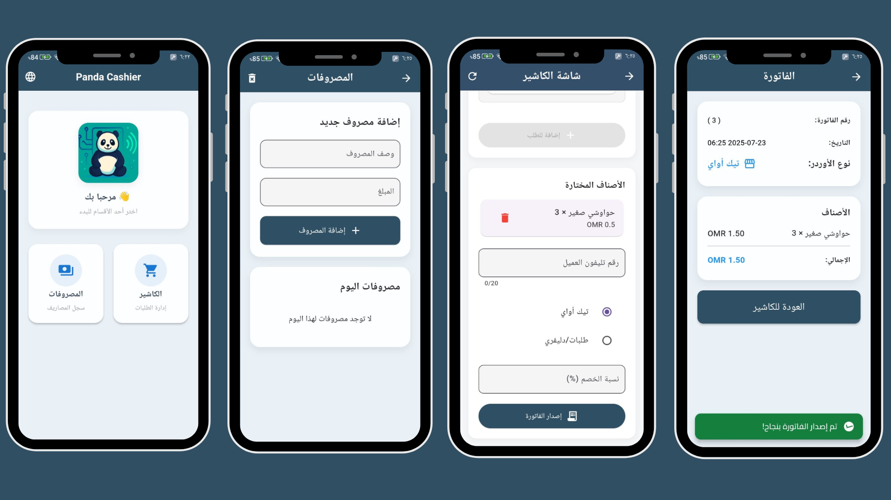
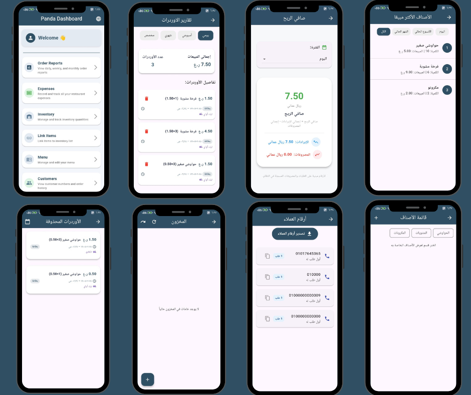

# PandaPOS - نظام إدارة المطاعم والكافيهات

[🔗 تصفح الموقع الرسمي وشاهد كل المميزات](https://pandapos.netlify.app/)

نظام شامل لإدارة المطاعم والكافيهات، يوفر لك:
- تطبيق للكاشير  
- تطبيق للإدارة  
- تقارير لحظية  
- إدارة مخزون  
- دعم متعدد اللغات  

والمزيد من الأدوات التي تساعدك على تطوير عملك وتقليل الأخطاء.

---

##  صور من النظام

  
  

---

## ⭐ أهم المميزات

- **إدارة الطلبات والمبيعات اليومية** بسهولة وسرعة.
- **تقارير لحظية** للأرباح والمصروفات.
- **إدارة المخزون** وربطه تلقائيًا بالطلبات.
- **تصدير البيانات** والتقارير إلى Excel.
- **تتبع الطلبات المحذوفة** وسجل كامل لأي تعديل.
- **دعم متعدد اللغات** (عربي / إنجليزي).
- **واجهة استخدام سهلة وسريعة** مناسبة لكل المستخدمين.

---

## 📞 تواصل معنا

لأي استفسار أو طلب تجربة مجانية:  
[تواصل عبر واتساب](https://wa.me/96877186754)

---

## ©️ حقوق الملكية

جميع الحقوق محفوظة لنظام PandaPOS © 2025
